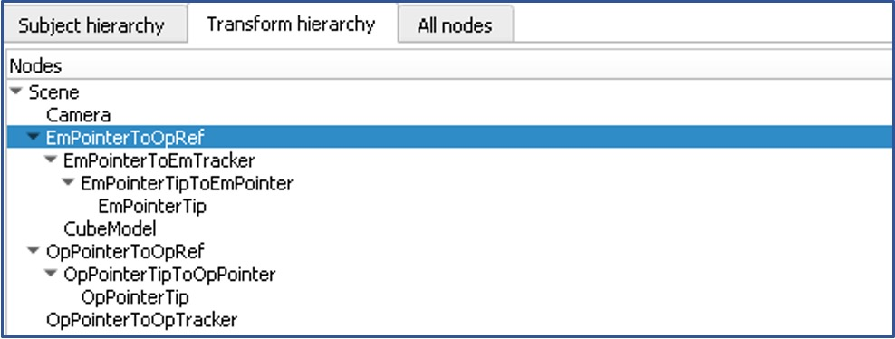

# EM Sensor Accuracy Module

## Introduction

This module is designed to quickly determine the accuracy of electromagnetic (EM) sensors using optical tracking as a ground truth.

## Features

- High-precision EM sensor accuracy measurement
- Integration with optical tracking systems for ground truth validation
- Real-time data analysis and visualization capabilities

## Getting Started

### Prerequisites

Before you begin, ensure you have the following downloaded:
- 3D Slicer (https://download.slicer.org)
- Motive (https://optitrack.com/support/downloads/) use motive 2
- NDI Aurora Toolkit (\NDI_Tracker\NDIAurora-4.003\Windows\setup) and drivers (\NDI_Tracker\NDIAurora-4.003\Windows\USB Driver)

### Installation


#### Slicer Setup
Within the Slicer Extension Manager install the OpenIGTLink module.

To install this module, run the following commands:

```
git clone https://github.com/SlicerIGT/SlicerTrackingErrorInspector.git
```

Now in slicer: Edit -> Application Settings -> Modules, Drag and drop the TrackingErrorIsosurface Module in the Additional Module Paths section.

#### NDI Setup
Go to the NDI Aurora file path (\NDI_Tracker\NDIAurora-4.003\Windows\setup). Install the NDI Toolkit. Once done, to install drivers open Device Manager, and within USB section, there should be a new unknown COM which will represent your unknown NDI driver. To install the drivers, right click on the usb driver, then update driver, update from local file, this file is (\NDI_Tracker\NDIAurora-4.003\Windows\USB Driver). If unable to install driver, restart your computer and drivers should install.

Once Driver and toolkit is installed, NDI Track application can be run to double check if everything works.

#### Optitrack Setup
Once motive is installed, turn on and connect Optitrack camera to computer. Then open Motive. 

Within Motive, adjust the exposure within the camera section to ensure that only the optical sensors are seen by the camera. 

Open View -> Asset View. Then highlight your corresponding points, then right click, then make rigid body. Rename your rigid body accordingly.

Once done, Go to File -> Export Profile As. Save the file in a folder.

This is a great resource if there are any issues (https://andysbrainbook.readthedocs.io/en/latest/Slicer/Slicer_Short_Course/Slicer_03_Motive.html)


#### Plus Toolkit Setup
Install Plus Toolkit (https://plustoolkit.github.io) any version works.

Now to connect the hardware to Slicer, we will need to write a Plus config file. I have attached a .xml file which can be used. If additional information is needed on this use this website (http://perk-software.cs.queensu.ca/plus/doc/nightly/user/index.html?_ga=2.246106765.804972664.1706142553-1707840069.1706142553).

To enable connection to slicer, within slicer, open the OpenIGTLink module, Create new connector by click + button, Active. To double check open the I/O Configuration, expand everything and the IN should have information recieved.

## Usage


Here's a quick start guide to using the EM Sensor Accuracy module:

Create 2 coordiate models, OpPointerTip and EmPointerTip. Then Create 2 Transforms, OpPointerTipToOpPointer and EmPointerTipToEmPointer.

Now within the data module organize the hierarcy like this:


EmPointerToOpRef is not yet determined, but before we find we we must perform a pivot calibration on the OpPointerTipToOpPointer and the EmPointerTipToEmPointer. Then we will use the regestration wizard to find the points from the EmPointer To the OpRef.

Once this is done this hierarcy can be acheived, and the OpPointerTip and EmPointerTip should be overlapping.

Now open the TrackingErrorIsosurface Module, and click collect points, to aquire a series of points (around 20 is recommended). Once points are collected click Create TPS. This will create a transform. 

Create an ROI around the collected points. Then within Transforms go to the created transform. Open the Display section, Make sure Region is the created ROI, then click on visibility.

The error should now be visible.


## Contributing

Contributions to this project are welcome!

## Contact

For support or inquiries, please contact us at [18pdc1@queensu.ca].
